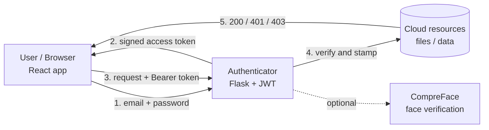
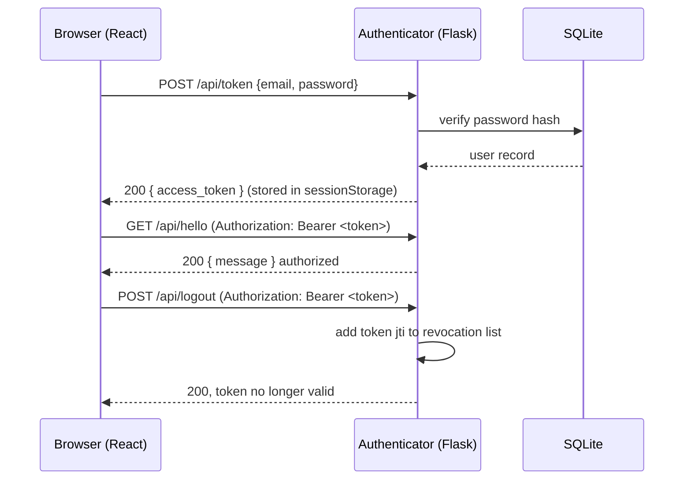

# Privacy Preservation in Public Cloud

> An external authentication layer that sits between users and a public cloud, so
> that nobody, not even the cloud host, can access a user's files without a
> valid, session-scoped access token.

[](https://www.python.org/)
[](https://flask.palletsprojects.com/)
[](https://react.dev/)
[](https://vitejs.dev/)
[](https://jwt.io/)
[](LICENSE)

This is the reference implementation of my B.E. (Information Science) capstone
project at BMS College of Engineering (2021-22). The original source was lost, so
this repository is a clean, working reconstruction faithful to the original
project report, rebuilt with a modern toolchain and made genuinely runnable. See
[docs/ARCHITECTURE.md](docs/ARCHITECTURE.md) for how each part maps back to the
report. (Tip: drop your report PDF at `docs/capstone-report.pdf` to keep it
alongside the code.)

## What it does

Public cloud users have to trust that the cloud provider won't read their data.
This project removes that assumption by adding an independent authenticator in
front of the cloud:

- A user authenticates against our server (not the cloud host) and receives a
  JWT access token.
- Every request to a protected resource must carry that token in its
  `Authorization: Bearer <token>` header. The server stamps and verifies each
  request.
- No token gives back 401 Unauthorized. Someone else's file gives 403 Forbidden.
  A valid, authorized request gives 200 OK.
- The token lives only in the browser's session storage and is revoked on the
  server the instant the user logs out.
- An optional biometric second factor (face verification via
  [Exadel CompreFace](https://github.com/exadel-inc/CompreFace)) can be layered
  on top for higher-assurance logins.

## Architecture



Request lifecycle:



## Tech stack

| Layer      | Technology                                        |
| ---------- | ------------------------------------------------- |
| Frontend   | React 18, React Router 6, Vite 5                  |
| Backend    | Python 3, Flask, Flask-JWT-Extended, Flask-CORS   |
| Auth       | JSON Web Tokens (HS256), Werkzeug password hashing |
| Storage    | SQLite (standard library, zero external DB)       |
| Biometrics | Exadel CompreFace (optional, Docker)              |
| Tests      | pytest                                            |

## Quick start

You need Python 3.10+ and Node 18+.

### 1. Backend (API)

```bash
cd backend
python -m venv venv

# Windows
venv\Scripts\activate
# macOS / Linux
source venv/bin/activate

pip install -r requirements.txt
cp .env.example .env          # Windows: copy .env.example .env
python run.py                 # http://127.0.0.1:3001
```

On first run the database is created and a demo account is seeded
(`test` / `test`) with a couple of sample files.

### 2. Frontend (web app)

In a second terminal:

```bash
cd frontend
npm install
npm run dev                   # http://localhost:3000
```

Open http://localhost:3000, click Login, and sign in with `test` / `test`. The
Vite dev server proxies all `/api/*` calls to the Flask backend, so you only deal
with a single origin.

## API reference

Base URL: `http://127.0.0.1:3001`

| Method | Endpoint            | Auth   | Description                                    |
| ------ | ------------------- | ------ | ---------------------------------------------- |
| GET    | `/api/health`       | none   | Liveness probe plus whether face auth is on.   |
| POST   | `/api/register`     | none   | Create a new user `{email, password}`.         |
| POST   | `/api/token`        | none   | Log in; returns `{ access_token }`.            |
| GET    | `/api/me`           | Bearer | Current user's profile.                        |
| GET    | `/api/hello`        | Bearer | The canonical protected resource.              |
| GET    | `/api/files`        | Bearer | List the caller's cloud files.                 |
| GET    | `/api/files/<id>`   | Bearer | Read one file (403 if not the owner).          |
| POST   | `/api/logout`       | Bearer | Revoke the current token.                      |
| GET    | `/api/face/status`  | none   | Whether CompreFace is configured.              |
| POST   | `/api/face/verify`  | Bearer | Verify two face images (base64) via CompreFace.|

<details>
<summary><b>Example: log in and call a protected route</b></summary>

```bash
# 1. Get a token
TOKEN=$(curl -s -X POST http://127.0.0.1:3001/api/token \
  -H "Content-Type: application/json" \
  -d '{"email":"test","password":"test"}' | python -c "import sys,json;print(json.load(sys.stdin)['access_token'])")

# 2. Use it
curl http://127.0.0.1:3001/api/hello -H "Authorization: Bearer $TOKEN"
# {"message":"test is successfully logged in for cloud access."}

# 3. Without a token
curl -i http://127.0.0.1:3001/api/hello
# 401 {"msg":"Missing Authorization Header"}
```

</details>

## Optional: face verification (CompreFace)

The report's second factor uses [Exadel CompreFace](https://github.com/exadel-inc/CompreFace),
a free, self-hosted face-recognition service. It is disabled by default so the
app runs with zero extra infrastructure. To enable it:

1. Run CompreFace with Docker (see their [quick start](https://github.com/exadel-inc/CompreFace#getting-started-with-compreface)).
2. Create a Face Verification service in the CompreFace UI and copy its API key.
3. In `backend/.env`, set:
   ```
   COMPREFACE_URL=http://localhost:8000
   COMPREFACE_API_KEY=<your-key>
   FACE_SIMILARITY_THRESHOLD=0.95
   ```
4. Restart the backend. `POST /api/face/verify` now proxies to CompreFace and
   accepts a login only when the similarity clears the threshold.

## Testing

```bash
cd backend
venv\Scripts\activate      # or: source venv/bin/activate
pytest -q
```

The suite exercises the whole flow: health check, login, bad credentials (401),
protected access (200), ownership enforcement (403), registration, and
logout-based token revocation.

## Project structure

```
.
├── backend/
│   ├── run.py                 # dev entry point
│   ├── requirements.txt
│   ├── .env.example
│   ├── src/
│   │   ├── __init__.py        # Flask app factory + JWT handlers
│   │   ├── config.py          # env-driven configuration
│   │   ├── database.py        # SQLite data layer
│   │   ├── auth.py            # /register /token /logout /me
│   │   ├── protected.py       # /hello /files (token-gated)
│   │   └── face.py            # /face/* CompreFace proxy (optional)
│   └── tests/
│       └── test_auth.py
├── frontend/
│   ├── index.html
│   ├── vite.config.js         # dev server + /api proxy
│   └── src/
│       ├── main.jsx
│       ├── App.jsx            # routes
│       ├── api.js             # fetch client + token storage
│       ├── auth/AuthContext.jsx
│       ├── components/        # Navbar, ProtectedRoute
│       └── pages/             # Home, Login, Dashboard, Logout
├── docs/
│   └── ARCHITECTURE.md
├── LICENSE
└── README.md
```

## Roadmap

Straight from the report's future enhancements, plus a few production notes:

- [ ] Wire the CompreFace face token into the login flow as a true second factor.
- [ ] Persist the token revocation list in Redis (currently in-process).
- [ ] File upload/download to a real object store (S3-compatible).
- [ ] Refresh tokens plus short-lived access tokens.
- [ ] Dockerise the whole stack with `docker-compose`.

## Authors

- Gagandeep S (1BM18IS035)
- Deevith H T (1BM18IS031)

Guided by Prof. Chandrakala G Raju, Department of Information Science and
Engineering, BMS College of Engineering.

## License

Released under the [MIT License](LICENSE).
